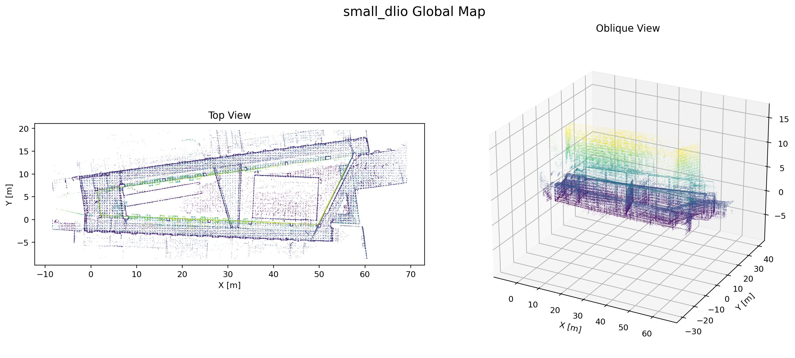

# small_dlio

一个基于 ROS 2 Jazzy 的轻量级 LiDAR-IMU 里程计/建图实验工程，当前面向 Livox Mid-360 数据流开发。

当前仓库包含：

- `OdomNode`：IMU 预积分、点云去畸变、submap 构建、GICP 配准、状态发布
- `MapNode`：订阅 keyframe 点云并在线累积发布全局地图的初版节点

## 当前状态

目前工程重点仍是里程计主链路，建图节点是初版实现，已经可以：

- 订阅 `/keyframe`
- 累积 keyframe 点云
- 发布 `/global_map`

但还没有做完整的地图管理能力，例如：

- 全局地图降采样更新策略
- 地图保存/加载
- 分块地图或局部地图裁剪
- 后台优化/回环

## 目录结构

```text
small_dlio/
├── src/dlio/
│   ├── config/config.yaml
│   ├── include/small_dlio/
│   ├── launch/full.launch.py
│   └── src/
│       ├── main.cpp
│       ├── odom_node.cpp
│       └── map_node.cpp
├── quick_source.sh
└── README.md
```

## 依赖环境

- Ubuntu 24.04
- ROS 2 Jazzy
- `livox_ros_driver2`
- PCL
- Eigen3
- OpenMP
- `small_gicp`

构建前需要 source：

```bash
source /opt/ros/jazzy/setup.bash
source /home/goose/fastlio/livox_ws/install/setup.bash
```

或者使用一键 source 脚本：

```bash
source quick_source.sh
```

## 构建

```bash
colcon build --packages-select dlio --event-handlers console_direct+
```

## 运行

启动节点：

```bash
source install/setup.bash
ros2 launch dlio full.launch.py rviz:=false
```

回放当前测试 bag：

```bash
ros2 bag play /home/goose/fastlio/rosbag2_mid360_10hz --clock
```

如果需要 RViz：

```bash
ros2 launch dlio full.launch.py rviz:=true
```

## 默认订阅与发布

### 订阅

- `/livox/imu`
- `/livox/lidar`
- `/keyframe`

### 发布

- `/odom`
- `/pose`
- `/path`
- `/tf`
- `/tf_static`
- `/deskewed`
- `/global_map`

## 关键参数

配置文件位置：

[`src/dlio/config/config.yaml`](/home/goose/small_dlio/src/dlio/config/config.yaml)

当前较关键的参数包括：

- `kf_trans_thresh`：关键帧平移阈值
- `kf_rot_thresh`：关键帧旋转阈值
- `max_alignment_score`：GICP 接受阈值
- `gicp_leaf_size`：配准前点云降采样体素大小
- `gicp_num_threads`：GICP 线程数
- `map_leaf_size`：地图体素参数，当前建图节点尚未完整使用

## 可视化检查

回放 bag 后，至少应能看到这些话题：

- `/odom`
- `/pose`
- `/path`
- `/tf`
- `/deskewed`
- `/global_map`

建议固定坐标系使用 `odom`。

## 运行截图

下面这张图由保存下来的 `global_map.pcd` 离线渲染得到，左侧是俯视图，右侧是斜视图。



## 后续待做

- 为 `MapNode` 加入 voxel filter，避免全局地图无限膨胀
- 增加地图保存服务
- 增加地图加载与重发布能力
- 将 odom / map 节点进一步解耦
- 评估是否引入回环或离线建图流程
